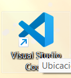
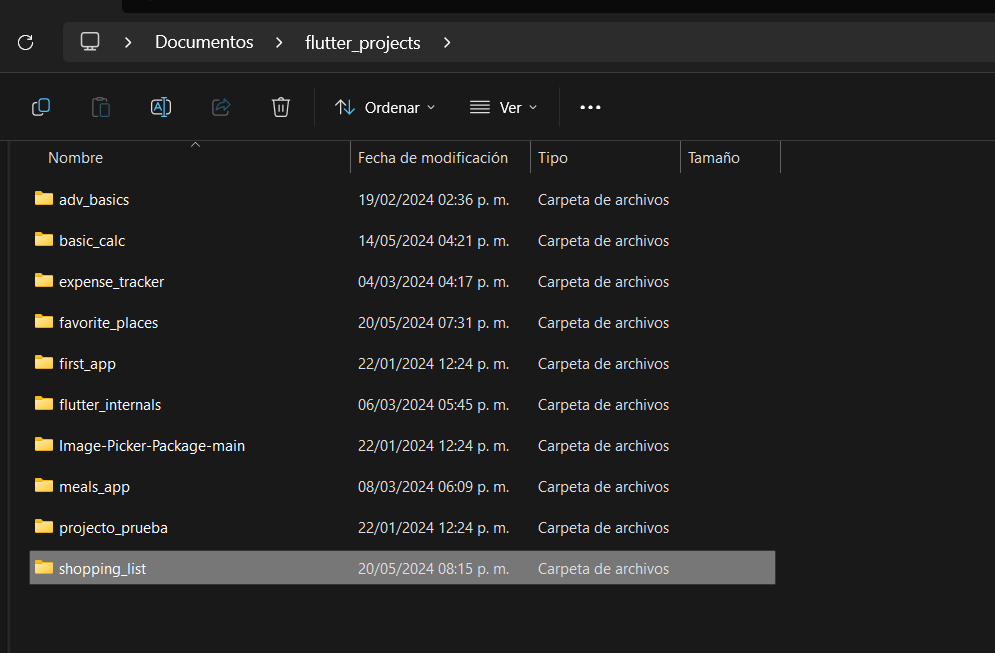
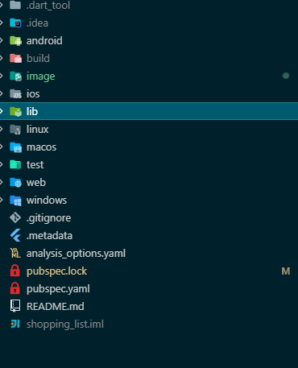
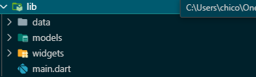
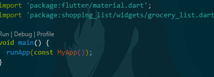
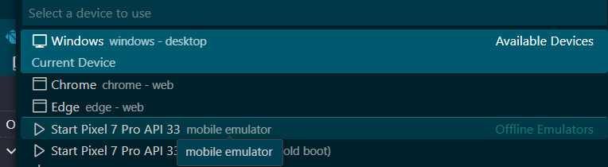
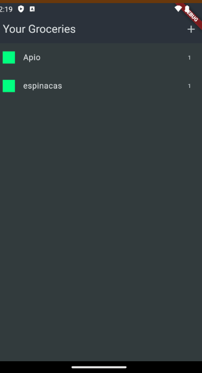
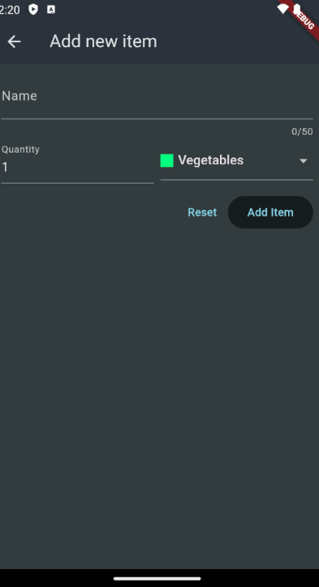

# shopping_list

Aplicación que permite crear guardar registros de compras mediante una base en firebase

## Descarga e instalación.

Ejecutar los siguientes comandos

Paso 1: Clonar el repositorio

```nginx
git clone https://github.com/LuisFer27/shopping_list.git

```

Paso 2 :Abrir visual studio code



Paso 3 seleccionar la carpeta en donde se guardo el repositorio en la opción  archivo y abrir carpeta

se selecciona la carpeta en donde esta ubicado el repositorio ya que en este caso esta almacenado en documentos pero puede variar según el lugar en de lo tengas descargado

Paso 4  una vez abierta la carpeta nos apareceran todas estas carpetas sin embargo la que nos interesa es la de lib en donde se alamcena todo los archivos dart para la ejecución de la aplicación



Paso 5 abriremos la carpeta lib y nos dirigiremos al archivo main .dart



abrimos el archivo main.dart y se nos visualizara de esta forma 

```dart
import 'package:flutter/material.dart';
import 'package:shopping_list/widgets/grocery_list.dart';

void main() {
  runApp(const MyApp());
}

class MyApp extends StatelessWidget {
  const MyApp({super.key});

  // This widget is the root of your application.
  @override
  Widget build(BuildContext context) {
    return MaterialApp(
      title: 'Flutter Groceries',
      theme: ThemeData.dark().copyWith(
        useMaterial3: true,
        colorScheme: ColorScheme.fromSeed(
          seedColor: const Color.fromARGB(255, 147, 229, 250),
          brightness: Brightness.dark,
          surface: const Color.fromARGB(255, 42, 51, 59),
        ),
        scaffoldBackgroundColor: const Color.fromARGB(255, 50, 58, 60),
      ),
      home: const GroceryList(),
    );
  }
}

```

en este caso en el editor le daremos click en run

depende del dispositivo que dispongamos este se ejecutar si no podemos cambiarlo abajo de nuestra editor 




y escoger nuestro dispositivo principalmente movil ya que en este caso podemos seleccionar movil o virtual como en este ejemplo




## Funcionalidad.



Pantalla principal permite visualizar la lista de la informaxción de dicho producto que esta almacenado en firebase

Botón más permite añadir un nuevo registro abriendo un formulario

Formulario: permite agregar un nombre  del producto,la cantidad de  productos que se quieren adquirir y la categoria al que pertenece



Botón reset permite limpiar los campos con toda la información

Botón add item permite añadir el dato que se visualizar en la lista y en firebase
